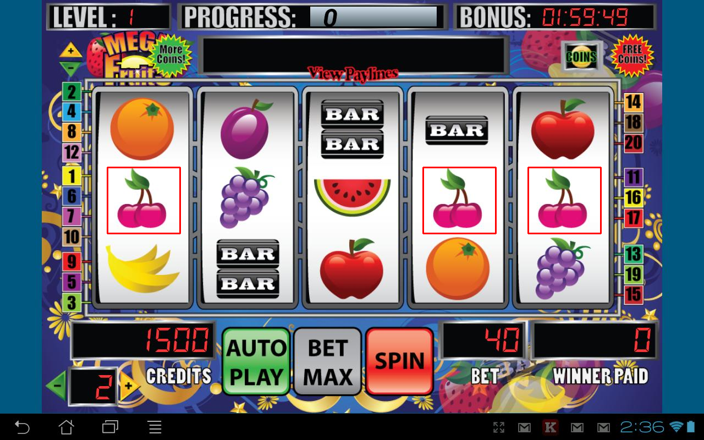

SubImage
========

Simple tooling to detect an image in another image. Origially coded to locate, for example, reel symbols on screenshots of video slots. Or detect and identify poker cards on screenshots of poker play.
Installation provides a small library of python functions and UNIX-like command line tools to find images within other images.
Package has dependencies upon python packages numpy, scipy, opencv (cv2) and argparse. Have run it on windows, but is primarily developed and tested in linuxmint 16.


Installation
============
To install, point pip to this github:
```
pip install git+https://github.com/johnoneil/subimage
```
Pip should manage dependencies nicely as of version 0.2. **However the openCV package (cv2) is not properly pacckage managed. CV2 (opencv library bindings for python, version 2) Installation by hand is necessary, and that's outside the cope of this doc.**
An example is [here](https://web.archive.org/web/20130620145414/http://www.neuroforge.co.uk/index.php/getting-started-with-python-a-opencv)

Command Line Tools
==================
Once installed, the package makes two command line tools available:
* subimage-find
* subimage-find-aspect-ratio

subimage-find
=============
Tool finds images in other images. Invoked in the form:
```
subimage-find -v mega_fruits.jpg cherry.png -o subimage_test.png
```
Which will find all instances of cherry.png within the primary image mega fruits.jpg and write its output to subimage_test.png.
There is an optional argument --confidence (value 0.0 to 1.0) which can be adjusted to fine tune search results.
The command above generated the image below. Found instances of the cherry.png image within the larger image are outlined in RED.


subimage-find-aspect-ratio
==========================
Fid graphical elements (really connected components) within a primary image by their rectangular bounding box aspect ratio. Invoked in the form:
```
subimage-find-aspect-ratio poker.jpg --aspect 0.7 --error 0.02 -v
```
The above command generated output as below (cards in the image are of aspect ratio 0.7+/-0.03).Found instances of graphical element with the required aspect ratio are outlined in RED.


Example Test
============
There's a simple image recognition style test in the subimage/test director entitled 'test01.py'. This script examines local (only) files to do simple recognition of poker cards. An example run follows:
```
(subimage_test)joneil@joneilDesktop ~/code/subimage/test $ ./test01.py 
Card found at 1021,113: diamond 6
Card found at 1048,119: heart ace
Card found at 424,242: heart 2
Card found at 514,242: club 6
Card found at 604,242: spade 8
Card found at 694,242: diamond jack
Card found at 784,242: spade king
Card found at 1139,319: diamond 7
Card found at 1166,325: club 7
```
This correctly identifies the cards in the above poker image example.

Status
======
I put together this code just as a proof of concept. Besides checking if it runs on my current system once or twice a year I'm not really maintaining it.
TBH, i'd really like to remove the OpenCV dependency, which should be possible, but haven't done it yet.
